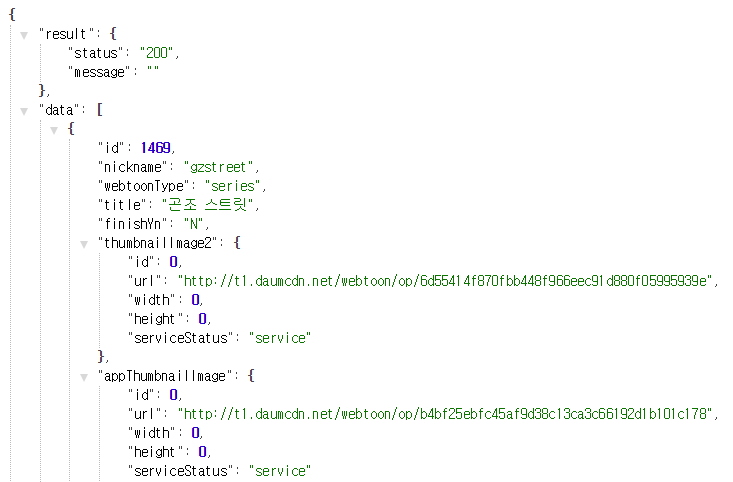

# 18.06.11

## Cloud9 - Ruby

#### 1. 웹툰 제목, 그림, 링크 크롤링 하기

````ruby'
=begin

1. 다음, 네이버 웹툰에서 웹툰 데이터를 크롤링한다.
2. 두 사이트에서 받아온 데이터 형태를 일치시킨다. 데이터는 웹툰제목, 썸네일 이미지, 웹툰을 볼수 있는 링크
3. 랜덤으로 비복원추출을 하려면 배열 형태로 데이터를 만든다.
4. 배열안에 있는 웹튼 1개의 데이터는 해쉬(딕셔너리) 형태로 만든다.
4. 웹튼 3개를 뽑아서 <table>태그를 이용하여 표로 보여준다.

추가과제
1. 각 요일별로 추출하기
2. 버튼에 일 ~ 토요일까지 버튼을 만들고, /webtoon?day=mon
=end

````

	#### 	app.rb - /webtoon 작성

* 다음 웹툰 페이지에서 웹툰 내용 크롤링 해서 3개 랜덤으로 뽑기

* ````ruby
   # daumurl = RestClient.get(URI.encode("http://comic.naver.com/webtoon/weekday.nhn"))
      # result = Nokokgiri::HTML.parse(daumurl)
      # mon1 = result.css('#content > div.list_area.daily_all > div.col.col_selected > div > ul > li:nth-child(1) > a')
      # puts mon1
      
      # @mon1.text   => 
   ````
  ````

​````ruby
require 'sinatra'
# require 'sinatra/reloader'
require 'json'
require 'rest-client'
require 'nokogiri'
require 'csv'

get '/' do
    erb :index
end

get '/webtoon' do
    ################################ 뭐 부터 먼저 해야하는가?
    
    # 내가 받아온 웹툰 데이터를 저장할 배열 생성
    # 웹툰 데이터를 받아올 url 파악 및 요청 보내기
    # 응답으로 온 내용을 해쉬 형태로 바꾸기
    # 해쉬에서 웹툰 리스트에 해당하는 부분 순환하기
    # 필요한 부분을 분리해서 처음 만든 배열에 push 
    
    # jason formatter 설치 (크롬) ####################################### 
    
    toons = []
    		# 내가 받아온 웹툰 데이터를 저장할 배열 생성
    
    url = "http://webtoon.daum.net/data/pc/webtoon/list_serialized/mon"
    result = RestClient.get(url)
    		# 웹툰 데이터를 받아올 url 파악 및 요청 보내기
    
    webtoons = JSON.parse(result)
        	# 응답으로 온 내용을 해쉬 형태로 바꾸기
    
    webtoons["data"].each do |toon|
    		# 해쉬에서 웹툰 리스트에 해당하는 부분 순환하기

    # http://webtoon.daum.net/data/pc/webtoon/list_serialized/mon 에서 
        # 웹툰 제목
        title = toon["title"]
        # 웹툰 이미지 주소  
        image = toon["thumbnailImage2"]["url"]  # 썸네일 안에서 url을 뽑아야됨.
        # 웹툰을 볼 수 있는 주소
        link = "http://webtoon.daum.net/webtoon/view#{toon["nickname"]}"
    # 필요한 부분을 분리해서 처음 만든 배열에 push
        toons << {"title" => title, # title이라는 키의 값(value)은 title 
                "image" => image,
                "link" => link
                }
    end
    # 완성된 배열 중에서 3개의 웹툰만 랜덤 추출
    # view에서도 쓸 수 있는 걸 만들어주어야함.
    @daum_webtoon = toons.sample(3)
    erb :webtoon
end
  ````

*  url = "http://webtoon.daum.net/data/pc/webtoon/list_serialized/mon"  내용

#### 

#### 	index.erb

````html
<html>
    <head>
        <body>
            <h1> Go Go Go Go Go</h1>
            <ol>
                <a href="/webtoon"><h1><li> 웹툰 종합 </li></h1></a>
                <a href="/check_file"><h1><li> 파일 확인 </li></h1></a>
            </ol>
        </body>
    </head>
</html>

````

##### 	webtoon.erb

````html
<table>
    <thead>
        <th>이미지</th>
        <th>제목</th>
        <th>링크</th>
    </thead>
    <tbody>
        <% @daum_webtoon.each do |toon|%>
        <tr>
            <td>"></td>
            <td><%= toon["title"]%></td>
            <td><a href ="<%= toon["link"]%>">보러가기</a></td>
        </tr>
        <% end %>
    </tbody>
</table>
<h1><%=@daum%><h1>
````

#### Ruby 문법

* 객체 - attribute 속성 = 모든 것이 메서드고, 객체이다.


----------

### 2.웹툰 제목, 그림, 링크 크롤링 하기


#### app.rb - /check_file

````ruby
1. 데이터는 기본적으로 한번만 받아온다.        # root 폴더로
2. 만약에 데이터가 있으면, 전체 목록을 불러오는 `/`로 리디렉션 해준다.
3. 만약에 데이터가 없으면, 모든 정보를 저장하는 CSV 파일을 새로 만들어준다.
````

````csv
	1,신의탑,네이버아디,누구,누구,링크,네이버
	2,스타워즈,다음아디,누구,누구,링크,카카오	
````

````command
CSV + ruby
https://stackoverflow.com/questions/17866291/what-is-the-second-parameter-argument-to-csv-open-in-ruby

CSV.open

From the IO Open Mode documentation:
"r" Read-only, starts at beginning of file (default mode).
"r+" Read-write, starts at beginning of file.
"w" Write-only, truncates existing file to zero length or creates a new file for writing.
"w+" Read-write, truncates existing file to zero length or creates a new file for reading and writing.
"a" Write-only, starts at end of file if file exists, otherwise creates a new file for writing.
"a+" Read-write, starts at end of file if file exists, otherwise creates a new file for reading and writing.

````


````ruby
get '/check_file' do
     # 파일이 있는지 없는지 어떻게 파악할까요?
    
#  if CSV.read('./test.csv').nil? 
#  if File.file?('./test.csv')  # 현재 경로에서 csv 파일이 있니?  .nil? 이게 비어있니?

    unless File.file?('./test.csv')			# 파일 존재 여부 판단.
            toons = []

            url = "http://webtoon.daum.net/data/pc/webtoon/list_serialized/mon"
            result = RestClient.get(url)
            webtoons = JSON.parse(result)
            webtoons["data"].each do |toon|
            title = toon["title"]
            image = toon["thumbnailImage2"]["url"]
            link = "http://webtoon.daum.net/webtoon/view/#{toon['nickname']}"
            toons << [title,image,link]
    end
        #CSV 파일을 새로 생성하는 코드
        CSV.open('./test.csv', 'w+') do |row|
            toons.each_with_index do |toon, index|
                row << [index+1, toon[0], toon[1], toon[2]]
                
#       CSV.open('/test.csv','w+') do |row|
#            row << ["1","title1", "img_url1", "link1"]
#            row << ["2","title2", "img_url2", "link2"]
#            row << ["3","title3", "img_url3", "link3"]
                           
            end
        end
        erb :check_file
    else
        #존재하는 CSV 파일을 불러오는 코드
        @webtoons = []
        CSV.open('./test.csv', 'r').each do |row|
         @webtoons << row
        end
        erb :webtoons
    end
end
````

#### 	test.csv

````csv
1,곤조 스트릿,http://t1.daumcdn.net/webtoon/op/6d55414f870fbb448f966eec91d880f05995939e,http://webtoon.daum.net/webtoon/view/gzstreet
2,우정으로 결혼한 소꿉친구,http://t1.daumcdn.net/webtoon/op/74311dc6807806bf2cc6839a71d8a86227453688,http://webtoon.daum.net/webtoon/view/friendmarriage
3,노동본색,http://t1.daumcdn.net/webtoon/op/582f7b1526486b6bf0b165d3427d97c011041fa5,http://webtoon.daum.net/webtoon/view/workinstinct
4,이끼 (2008),http://i1.cartoon.daumcdn.net/svc/image/U03/cartoon/U43CA81C4CCFDAF762,http://webtoon.daum.net/webtoon/view/ikki
5,강철비,http://t1.daumcdn.net/webtoon/op/54d6c3afb887921ec4dc78676a118d4bf0d782ad,http://webtoon.daum.net/webtoon/view/steelrain2
6,고양이 마마님,http://t1.daumcdn.net/webtoon/op/a2f86ed531940714434e3f32eac9153f1d772191,http://webtoon.daum.net/webtoon/view/CatQueen
7,과격자매단,http://t1.daumcdn.net/webtoon/op/3f2688b860ab1be0afef2bf0739254b9e69dd640,http://webtoon.daum.net/webtoon/view/SISTERS
8,스킬,http://t1.daumcdn.net/cartoon/589D754C0155350001,http://webtoon.daum.net/webtoon/view/Skill
9,간이역에 겨울이 오면,http://i1.cartoon.daumcdn.net/svc/image/U03/cartoon/5722F461025CA70001,http://webtoon.daum.net/webtoon/view/station
10,The 윷놀리스트,http://i1.cartoon.daumcdn.net/svc/image/U03/cartoon/5716098D06133D0001,http://webtoon.daum.net/webtoon/view/theyutnolist
11,일단 질러! 질렐루야,http://i1.cartoon.daumcdn.net/svc/image/U03/cartoon/5548B4280678E10001,http://webtoon.daum.net/webtoon/view/impulsebuyer
12,유치원의 하루,http://i1.cartoon.daumcdn.net/svc/image/U03/cartoon/5548B65A0657C60002,http://webtoon.daum.net/webtoon/view/kindergarten
13,유부녀의 탄생,http://i1.cartoon.daumcdn.net/svc/image/U03/cartoon/5548C6A10266F40001,http://webtoon.daum.net/webtoon/view/married
14,트레이스,http://i1.cartoon.daumcdn.net/svc/image/U03/cartoon/55666EE80142AB0005,http://webtoon.daum.net/webtoon/view/trace2
15,도깨비언덕에 왜 왔니?,http://t1.daumcdn.net/webtoon/op/e635e6bb64c13dc7a66872e1fca7891a13012c35,http://webtoon.daum.net/webtoon/view/goblinhill

````

#### 	webtoons.erb

````html
<table class="table">
    <thead>
        <th>글번호</th>
        <th>이미지</th>
        <th>제목</th>
        <th>링크</th>
    </thead>
    <tbody>
        <% @webtoons.each do |toon|%>
        <tr>
            <td><%=toon[0]%></td>
            <td>"></td>
            <td><%=toon[1]%></td>
            <td><a href="<%=toon[3]%>">보러가기</a></td>
        </tr>
        <% end %>
    </tbody>
</table>
<h1><%=@daum%><h1>
````

#### 	check_file.erb

````html
<h1>CSV 파일이 생성되었습니다.</h1>
````

-----------

### 3. layout.erb의 효과 +  CDN

````ruby
layout.erb 파일 생성시 테이블이 사라지고, 빈 화면이 나옴. =>    <%= yield %> 추가 필요함
````

````html
<html>
    <head><title> 멀캠 해커톤 화이팅 </title></head>   <!-- head 바뀜 -->

    <link rel="stylesheet" href="https://stackpath.bootstrapcdn.com/bootstrap/4.1.1/css/bootstrap.min.css" integrity="sha384-WskhaSGFgHYWDcbwN70/dfYBj47jz9qbsMId/iRN3ewGhXQFZCSftd1LZCfmhktB" crossorigin="anonymous">
        <!-- 위의 코드를 layout에서 쓰게 되면 다른 파일에서 반복 해서 쓸 필요가 없음 -->
        <!-- 화면 맨 위의 네비바 / 맨 아래 바는 어느 페이지를 가도 안사라짐 -->
    
        <!-- 똑같은 화면에 
           
    <!-- 이 파일을 만들면 check_file의 table이 사라짐. -->
    <!-- 이 사라진 내용을 어떻게 가져올 것인가?  [ 그림1 ]   --> 
    
        <body>    <%= yield %>             <!-- 보이게 해야되니까 =    -->             
        </body>
</html>
````


### 4. 기타

#### 오늘의 문제점 

````ruby
        CSV.open('./test.csv','w+') do |row|
                    . 안붙여줌.
````

#### gem conflict시 대처법

```command
# gem conflict

gem list sinatra 		 ()
gem list 				( 깔려 있는 gem 이 다 나옴.)

gem uninstall sinatra
ruby app.rb -o $IP -p $PORT
```

### 

workspace/app/layouts/application.html.erb