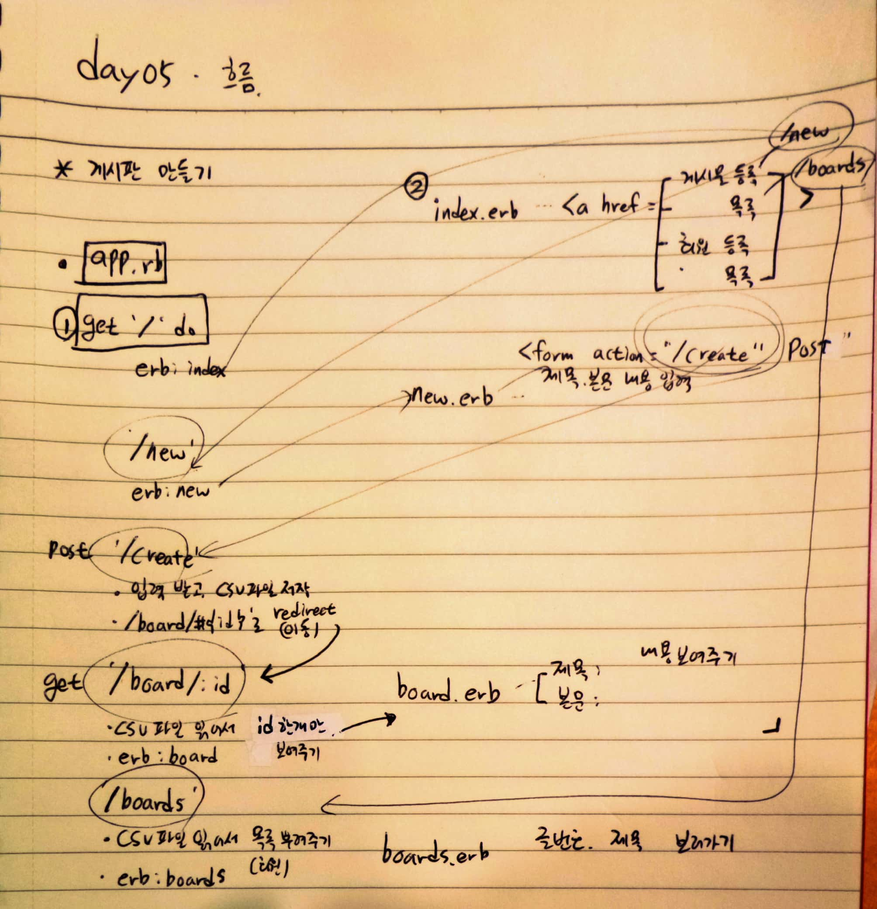

# 18.06.12

## Cloud9 + Ruby

* CRUD 중에서 CR을 하기.
  * 기본적인 데이터 처리 기능 =  Create(생성), Read(읽기), Update(갱신), Delete(삭제)
  * 사용자 인터페이스가 갖추어야 할 기능(정보의 참조/검색/갱신)을 가리키는 용어로서도 사용된다. 
* 자료가 저장되는 곳은 DB가 아니라 CSV 파일로 저장하기.
* 사용자의 입력을 받아서 간이 게시판을 만들기

-----------------

#### 과제 1

* 사용자의 입력을 받는 `form` 태그로 이루어진 `/new` 액션과 `erb` 파일
  * `form`의 `action` 속성은 `/create` 로 가도록 합니다.
  * `method`는  `post`를 이용합니다.
  * 게시판 글의 제목(title)과 본문(contents) 두가지 속성을 저장하기.
* 전체 목록을 보여주는 `table` 태그로 이루어진 `/boards`액션과 `erb` 파일
* 부트스트랩을 쓸 수 있도록 CDN 추가해달라. (http://getbootstrap.com/) - layout.erb로


* `/create` 액션을 만들고 작성 후에는  `/boards` 액션으로 돌아가게 구성
* `/create` 액션이 동작한 이후에는 본인이 작성한 글로 이동한다.
  * 사람들이 무식하게 할 것을 감안해서 짜야함
* 각 글(1개의 글을 보는 페이지)을 볼 수 있는 페이지는 `/board/글번호` 의 형태로 작성한다.

----------

#### Create 와 Read

1. `get` boards/new 
2. `post` boards/create
3. `get` /boards
4. `get` /board/:id


* `board` 라고 하는 게시판이 하나만 존재하고 있다.
* `user`라고 하는 CRUD 기능을 해야하는 DB Table을 만든다고 하면
* 새로운 유저를 등록한다면?




--------

--------

	##### app.rb - 게시물 등록

````ruby
require 'sinatra'
require 'csv'
# require 'sinatra/reloader'

get'/'do
 erb :index
end

get '/new' do
    erb :new
end


post '/create' do						

    # 사용자가 입력한 정보를 받아서 
    # CSV 파일 가장 마지막에 등록
    # => 이 글의 글번호도 같이 저장해야함.
    # => 기존의 글 개수를 파악해서
    #    그 글 갯수 + 1 해서 저장.
    
    title = params[:title] # 변수에 저장
    contents = params[:contents]
                                # w+ : 읽고, 쓰고 / 기존에 있는 파일을 지워버림.
#   id = CSV.read('./boards.csv', 'w+').count.to_i + 1  # CSV.open 과 유사함. / 읽기모드로 갯수를 셈.
    id = CSV.read('./boards.csv').size + 1  # CSV.open 과 유사함. / 읽기모드로 갯수를 셈.
    
    puts [id,title,contents]   # 아이디가 제대로 출력되는지 확인
    
    CSV.open('./boards.csv', 'a+') do |row|    # 각 줄에 우리가 작성한 id, title, contents 넣어주고.
        row << [id, title, contents]                # 어떤 모드가 더 좋은지 파악 해볼것! 
    end
#   redirect '/boards'
    redirect "/board/#{id}"
end


get '/boards' do

    # 파일을 읽기 모드로 열고
    # 각 줄을 순회하면서
    # @가 붙어있는 변수에 넣어줌.

    @boards = []                                  # 1
    CSV.open('./boards.csv', 'r').each do |row|   # 2  현재 폴더에 있는 csv 파일을 열겠다.
        @boards << row        
    end
    puts @boards
    erb :boards
end


get '/board/:id' do             # boards/글번호   => 와일드 카드로 사용!
    # CSV 파일에서 params[:id]로 넘어온 친구와 
    # 같은 글번호를 가진 row를 선택
    # => CSV 파일을 전체 순회한다.
    # => 순회하다가 첫번째 column이 id와 같은 값을 만나면
    # => 순회를 정지하고, 값을 변수에다가 담아준다.

    @board=[]
    CSV.read('./boards.csv').each do |row| # 각각 돌면서 row에 담아준다.
        if row[0].eql?(params[:id])   # 만약 row의 0번째가 파라미터로 넘어온 것과 같아진다면
  #     if params[:id]==row[0]

            @board = row
            break           # 그 값을 board에 넣어주고, 멈춘다.
        end
    end
    puts @board
    erb :board
end
````

##### index.rb

````html
<html>
    <head>
        <title> CSV 게시판</title>
    </head>
    <body>
        <a href='/new'><h1> 게시물 등록 </h1></a>
        <a href='/boards'><h1> 전 체 목 록 </h1></a>
        <br>
        <br>
        <a href='/user/new'><h1> 사용자 등록</h1></a>
        <a href='/users'><h1> 사용자 목록 </h1></a>
    </body>
</html>
````

##### new.erb

````html
<form action="/create" method="POST">

    제목 : <input type="text" name="title" placeholder="제목"><br>
    본문 : <textarea name="contents" placeholder="본문"></textarea><br>
    <input type="submit" value="등록하기">

</form>
````

##### board.erb

````html
<table>
<h1>제목 : <%= @board[1].to_s %></h1>
<h1>본문 : <%= @board[2] %></h1>

<!-- [1]이 title이고, [2]가 content가 된다. -->
</table>
````

##### boards.erb

````html
<table>
    <thead>
        <th> 글번호 </th>
        <th> 제목 </th>
        <th> 보러가기 </th>
    </thead>
    <tbody>
        <% @boards.each do |boards| %>
        <tr>
            <td><%= boards[0] %></td>
            <td><%= boards[1] %></td>
            <td><%= boards[2] %></td>
        </tr>
        <% end %>
    </tbody>
</table>
````

##### + boards.csv


#### 작업 중 오류 수정사항

````html
1. erb 파일 상에서 주소 입력 하는 것의 차이점
					원하는 값 => /board/create로 연결되어야함. => board/인덱스값
'/board/create'		->	board/2
'board/create'		->		/board/board/create
'create'			->	board/4
'/create'			->		/create

=> / 붙이면 root 주소창(ex> ~~.com/)에서 주소입력 됨
=> / 안붙이면 현재 주소(ex> ~~.com/home/~~/)에서 추가로 입력이 됨.

2. get '' 사이에 / 확인 할 것
3. CSV.open('./~~~.csv')  ( ./ , / 확인할 것!)

4. erb :~~~   => ~~~.erb 파일을 실행하겠다.		
5. redirect ' '  => ''로 이동하겠다. 			는 의미


6. expecting keyword_end end;end;end;end ^           => end 좀 넣어주세요.

7. CSV.open 사용시  => 개별 적인 것 하나하나 이므로 .each를 빼야함!

8. do 빼먹지 않기    /      post '/create' do   => get 쓰지 않고!!

````

##### layout.erb      - <%= yield %> / 부트스트랩, CSS, JS 쓸 수 있도록 추가해줌.

````html
<html>
    <head>
        <title> CSV 게시판 </title>
<link rel="stylesheet" href="https://stackpath.bootstrapcdn.com/bootstrap/4.1.1/css/bootstrap.min.css" integrity="sha384-WskhaSGFgHYWDcbwN70/dfYBj47jz9qbsMId/iRN3ewGhXQFZCSftd1LZCfmhktB" crossorigin="anonymous">
<script src="https://code.jquery.com/jquery-3.3.1.slim.min.js" integrity="sha384-q8i/X+965DzO0rT7abK41JStQIAqVgRVzpbzo5smXKp4YfRvH+8abtTE1Pi6jizo" crossorigin="anonymous"></script>
<script src="https://cdnjs.cloudflare.com/ajax/libs/popper.js/1.14.3/umd/popper.min.js" integrity="sha384-ZMP7rVo3mIykV+2+9J3UJ46jBk0WLaUAdn689aCwoqbBJiSnjAK/l8WvCWPIPm49" crossorigin="anonymous"></script>
<script src="https://stackpath.bootstrapcdn.com/bootstrap/4.1.1/js/bootstrap.min.js" integrity="sha384-smHYKdLADwkXOn1EmN1qk/HfnUcbVRZyYmZ4qpPea6sjB/pTJ0euyQp0Mk8ck+5T" crossorigin="anonymous"></script>
    </head>
    <body>
    <%= yield %>       <!-- 흐름을 다른 erb 파일에 양보하겠다. -->
    </body>
</html>

````

-----

-----------


#### 과제

* `user`를 등록할 수 있는 CSV 파일을 만들기

* Id, password, password_confirmation

* 조건 1

  * password와 password_confirmation을 받는데, 회원을 등록 할 때
    이 두 문자열이 다르면 회원 등록 안됨.

* Route(라우팅)

  * get /user/new		=> new_user.erb 

  * post /user/create

     get /users		          => users.erb

  * get /user:id                      => user.erb


##### app.rb - 회원 등록

````ruby
get '/user/new' do
    erb :new_user
end

post '/user/create' do
    
    puts params[:id], params[:password], params[:password_confirmation]
    if params[:password].eql?(params[:password_confirmation])
        users= []
        file = CSV.read('./users.csv','r+')
        file.each do |row|
            users << row[1]
        end
        puts file
        unless users.include?(params[:id])
            index = file.size + 1
        
    # 정상적인 가입 로직
        
            id = params[:id]
            password = params[:password]
    
        # if params[:password] != params[:password_confirmation]
        #     puts "비밀번호가 옳바르지 않습니다."
        #     erb :new_user
        # else
        #     erb :index
        # end

            CSV.open('./users.csv', 'a+') do |row|    # 각 줄에 우리가 작성한 id, title, contents 넣어주고.
                row << [index, id, password]                # 어떤 모드가 더 좋은지 파악 해볼것! 
            end
            redirect "/user/#{index}"
        else
            erb :error
        end
    else
    # error.erb 파일에는 회원가입에 실패했습니다. 메시지 띄우기.
        erb :error
    end
end

get '/users' do
    @users =[]
    CSV.open('./users.csv','r+').each do |row|
        @users << row
    end
    puts @users
    erb :users
end

get '/user/:id' do
    @user = []
    CSV.open('./users.csv', 'r+').each do |row|
        if row[0].eql?(params[:id])
            @user = row
            break
        end
    end
    erb :user
end
````

##### error.erb

```html
<h1> 회원가입에 실패하였습니다. </h1>
<a href="/user/new"> 다시 시도하시길 </a>
```

##### new_user.erb

`````html
<form action="/user/create" method="POST">
    ID       : <input type="text" name="id" placeholder="ID">
    Password : <input type="password" name="password" placeholder="password">
    Password : <input type="password" name="password_confirmation" placeholder="password">
<!-- value="여기"   => 여기 값을 쓰면 입력창에 그 값이 그대로 올라감.-->
    <input type="submit" value="사용자등록">
</form>
`````

##### user.erb

`````html
<h1> 회원 가입 성공 </h1>
<p> 가입 계정 : <%= @user[1] %> </p>
<a href="/users"> 전체 회원목록</a>

<!--<%= @user[0] %>-->
<!--<%= @user[1] %>-->

<!--<%= params[:id] %>-->
<!--<%= params[:passwod] %>-->
`````

##### users.erb

````html
<table class="table">
    <thead>
        <th> No </th>
        <th> ID </th>
    </thead>
    <tbody>
        <% @users.each do |user| %>
        <tr>
            <td><%= user[0] %></td>
            <td><%= user[1] %></td>
        </tr>
        <% end %>
    </tbody>
</table>
````

##### + users.csv

-------

--------

----------

강의 내용 : https://github.com/lovings2u/ruby_day5

