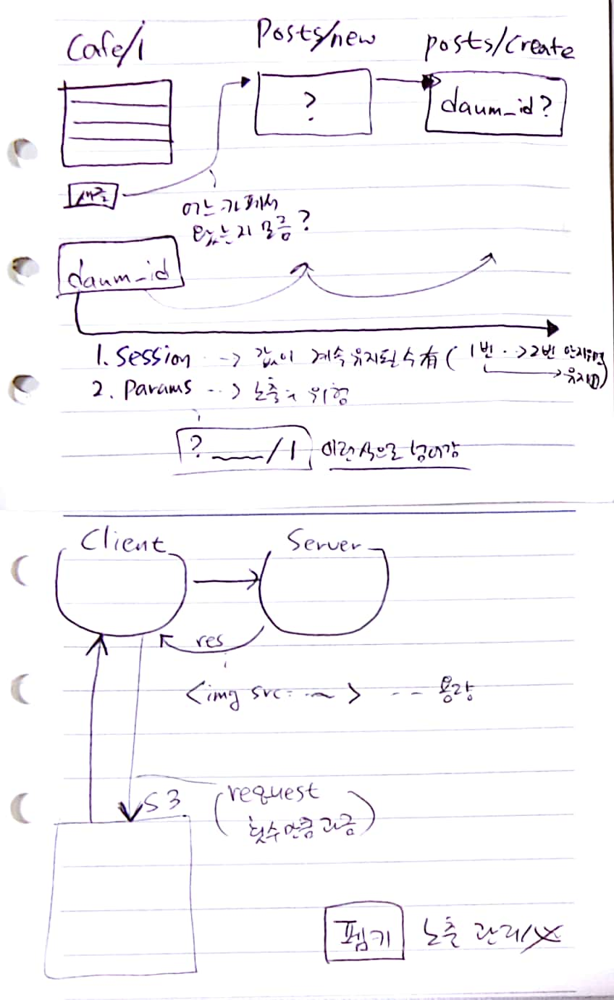

# 18.06.28

* 모델 코딩 (인스턴스 메서드 만들기)
* 모델코딩 (user_name에 중복 불허 속성 주기 - uniqueness 속성)
* 
* 
* 모델코딩 (클래스 메서드 만들기) 



클래스 메서드

인스턴스 메서드

uniqueness : true => model에 넣어주기.


Fat model / Skinny controller


db - post 내용 추가

  <div class="field">
    <%= f.label :image_path %>
    <%= f.file_field :image_path, class: 'form-control' %>
  </div>          


controller - params에 파일 추가함. : image_path) 


# 에러


````ruby
Started POST "/posts" for 222.107.238.15 at 2018-06-28 02:34:42 +0000
Cannot render console from 222.107.238.15! Allowed networks: 127.0.0.1, ::1, 127.0.0.0/127.255.255.255
Processing by PostsController#create as HTML
  Parameters: {"utf8"=>"✓", "authenticity_token"=>"EZzn/0TNrnt1+v4M1upSWsVqnxBOEsAFyAVRqYy0Qc79TtrOaGwafA4fJg3jJ34tyI1/+vQpUTGqhOuu7m5LdA==", "post"=>{"daum_id"=>"", "title"=>"12", "content"=>"123", "image_path"=>#<ActionDispatch::Http::UploadedFile:0x007fbe2dfa1200 @tempfile=#<Tempfile:/tmp/RackMultipart20180628-32760-194zmye.jpg>, @original_filename="프로젝트 일정 M 3 구 분 M M 1 M 2 시스템 구축 사용자 요구분석 기본 설계 서비스 전략 수립 데이터 모델링.jpg", @content_type="image/jpeg", @headers="Content-Disposition: form-data; name=\"post[image_path]\"; filename=\"\xED\x94\x84\xEB\xA1\x9C\xEC\xA0\x9D\xED\x8A\xB8+\xEC\x9D\xBC\xEC\xA0\x95+M+3+\xEA\xB5\xAC+\xEB\xB6\x84+M+M+1+M+2+\xEC\x8B\x9C\xEC\x8A\xA4\xED\x85\x9C+\xEA\xB5\xAC\xEC\xB6\x95+\xEC\x82\xAC\xEC\x9A\xA9\xEC\x9E\x90+\xEC\x9A\x94\xEA\xB5\xAC\xEB\xB6\x84\xEC\x84\x9D+\xEA\xB8\xB0\xEB\xB3\xB8+\xEC\x84\xA4\xEA\xB3\x84+\xEC\x84\x9C\xEB\xB9\x84\xEC\x8A\xA4+\xEC\xA0\x84\xEB\x9E\xB5+\xEC\x88\x98\xEB\xA6\xBD+\xEB\x8D\xB0\xEC\x9D\xB4\xED\x84\xB0+\xEB\xAA\xA8\xEB\x8D\xB8\xEB\xA7\x81.jpg\"\r\nContent-Type: image/jpeg\r\n">}, "commit"=>"작성하기"}
  User Load (0.2ms)  SELECT  "users".* FROM "users" WHERE "users"."id" = ? LIMIT ?  [["id", 7], ["LIMIT", 1]]
   (0.2ms)  begin transaction
  CACHE (0.0ms)  SELECT  "users".* FROM "users" WHERE "users"."id" = ? LIMIT ?  [["id", 7], ["LIMIT", 1]]
   (0.1ms)  rollback transaction
  Rendering posts/new.html.erb within layouts/application
  Rendered posts/_form.html.erb (3.2ms)
  Rendered posts/new.html.erb within layouts/application (4.8ms)
  User Load (0.2ms)  SELECT  "users".* FROM "users" WHERE "users"."id" = ? LIMIT ?  [["id", 7], ["LIMIT", 1]]
  Rendered shared/_nav.html.erb (2.2ms)
  Rendered shared/_footer.html.erb (0.5ms)
Completed 200 OK in 184ms (Views: 168.3ms | ActiveRecord: 0.7ms)
````

"daum_id"=>"" 를 못받아옴 => session을 제대로 받는지 확인하고 def show 부분에서 session을 만드는데, 그 곳을 거쳐서 하게끔 로직 짜주어야함.

=> 


https://github.com/carrierwaveuploader/carrierwave

````
carrrierwave 설치
gemfile
bundle install
dongho0892:~/daum_cafe $ rails g uploader image
Running via Spring preloader in process 33177
      create  app/uploaders/image_uploader.rb
      
      
You can use your uploader class to store and retrieve files like this:

uploader = AvatarUploader.new

uploader.store!(my_file)

uploader.retrieve_from_store!('my_file.png')
````

​		retrieve


Add a string column to the model you want to mount the uploader by creating a migration:

```
rails g migration add_avatar_to_users avatar:string
rake db:migrate
```

Open your model file and mount the uploader:

```
class User < ActiveRecord::Base
  mount_uploader :avatar, AvatarUploader
end
```


## Adding versions

그림의 버전 바꾸기 - 업로드 할때 그 파일 자체의 크기를 줄이는 등을 하고 싶을 때 


```
brew install imagemagick   => 우툰부에서는 안돌아감.

dongho0892:~/daum_cafe $ sudo apt-get update
dongho0892:~/daum_cafe $ sudo apt-get install imagemagick
```

````ruby
class MyUploader < CarrierWave::Uploader::Base
  include CarrierWave::MiniMagick

  process resize_to_fit: [800, 800]

  version :thumb do
    process resize_to_fill: [200,200]
  end

end
````

image_uploader.rb


Post.last.image_path


-------------

사용자 추가

내 보안자격 증명

| Access key ID | Secret access key |
| ------------- | ----------------- |
| `````         | `````             |

그룹추가

AmazonS3FullAccess 

그룹 내 사용자 추가


Amazon S3

버킷 만들기 


-------

carrierwave + AWS 연결해주는 라이브러리

## Fog

If you want to use fog you must add in your CarrierWave initializer the following lines

```
config.fog_provider = 'fog' # 'fog/aws' etc. Defaults to 'fog'
config.fog_credentials = { ... } # Provider specific credentials
```

gem 파일 인스톨

gem "fog-aws"


You'll need to provide your fog_credentials and a fog_directory (also known as a bucket) in an initializer.  	

````ruby
CarrierWave.configure do |config|
  config.fog_provider = 'fog/aws'                        # required
  config.fog_credentials = {
    provider:              'AWS',                        # required
    aws_access_key_id:     'xxx',                        # required
    aws_secret_access_key: 'yyy',                        # required
    region:                'eu-west-1',                  # optional, defaults to 'us-east-1'
    host:                  's3.example.com',             # optional, defaults to nil
    endpoint:              'https://s3.example.com:8080' # optional, defaults to nil
  }
  config.fog_directory  = 'name_of_bucket'                                      # required
  config.fog_public     = false                                                 # optional, defaults to true
  config.fog_attributes = { cache_control: "public, max-age=#{365.days.to_i}" } # optional, defaults to {}
end
````


config/initailizers/fog.rb 생성


우리의 aws 암호를 다른 곳에 넣어서 외부에서 끌어다 쓰게끔 처리할 예정

https://github.com/laserlemon/figaro

# [](https://raw.githubusercontent.com/laserlemon/figaro/1f6e709/doc/title.png)

Simple, Heroku-friendly Rails app configuration using `ENV` and a single YAML file

환경변수를 쉽게 잡아주는 것

gemfile 설정

```
dongho0892:~/daum_cafe $ bundle exec figaro install
      create  config/application.yml
      append  .gitignore   				=> 깃 push 할때 빠지게끔 해주는 친구.
dongho0892:~/daum_cafe $ vi .gitignore
```


서버 동작시키면 

config initailazer 파일 전체 처음에 다 훑고 감.


https://docs.aws.amazon.com/ko_kr/general/latest/gr/rande.html


fog + AWS 


img src="https://s3.ap-northeast-2.amazonaws.com/mulcam504/uploads/post/image_path/8/something.jpg" width="100%"


아마존 계정 생성 => 18.06.28 + pdws00111 삭제 할 것!!


AWS Certificated

Udemy


연습 => C9 에서 하고, 나중에 AWS로 할 것