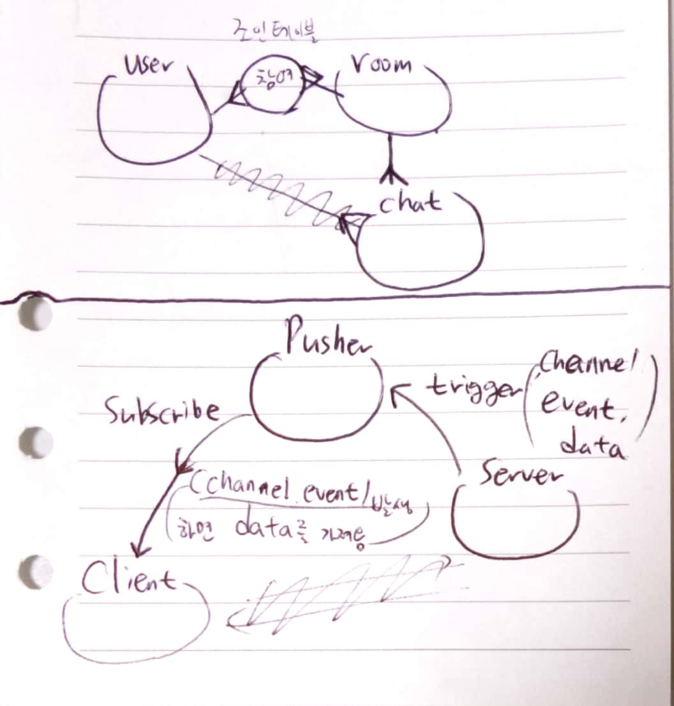
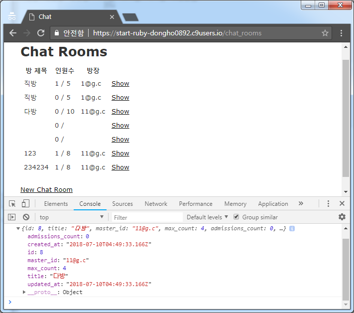
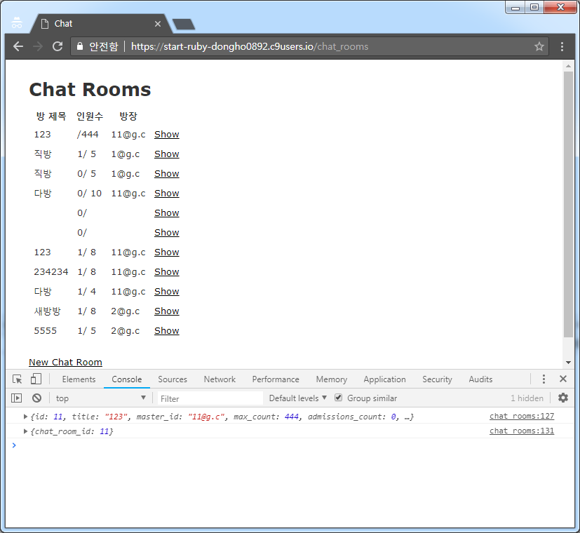

# 18.07.10

#### 어제 수업 복습 + 템플릿 작업하는 법

* bootstrap 버전 확인 : 최소 앞에 2자리는 맞추고 그에 맞춰서 gemfile을 설치한다.
* 우리가 사용할 테플릿 파일에서 사용하고 있는 stylesheet 파일들을 확인하고 vndor/assets/stylesheet에 Copy & paste한다.
  * vendor 폴더를 사용하는 이유는 거의 변화가 없는 css, js 등 library 정도에 해당하는 파일이 들어감.
  * 변화할 파일을 custom.css/style.css 은 app/assets/stylesheet에 넣어둔다.
* `app/assets/stylesheet/application.css -> scss`로 확장자를 바꾸고 우리가 vendor에 넣어준 파일들을 전부 import 한다. (여러개의 파일을 하나로 뭉치는 작업 )
  * 기존에 있던 *= 형태로 있는 import는 전부 제거한다.     @import '~~';
* 동일한 형태로 js도 진행한다. 새로운 컨트롤러가 만들어질 때, coffee 스크립트가 적용되는데, 이 확장자로 js로 바꿔준다. 
  * //= require-tree. 는 삭제하고, application.js에서는 bootstrap과 jquery or 모든 페이지에서 공통되는 js만 import 한다.
* `config/initializer/assets.rb` 에서
  * `Rails.application.config.assets.precompile` += %w(   )  부분 주석 처리를 해제하고, 우리가 사용할 컨트롤러에 해당되는 js와 scss 파일명을 나열한다.  ( precompile 준비 완료! )
* `rake assets:precompile` 을 실행해서 scss 파일과 js 파일에 이상이 없는지 확인한다. 이상이 있으면 css, js 에 맞춰서 수정한다.
* 이제 실제 body에 해당하는 부분을 우리 페이지로 가져오면 되는데, `nav, footer`는 파일을 분리하는 것이 좋다. 반복적으로 사용될 친구들은 render(partial)을 이용하여 view를 분리하는 것이 좋다.
* 실제로 우리가 만든 view에는 우리 서비스가 제공되는 페이지 로직이 들어간다. 
* js의 경우 대부분 문서 제일 마지막에 들어가는데, 이 부분을 해결하기 위해 `yield 'content_name'` 과 `content_for 'content_name'`과 전략을 사용한다.
* 우리가 작성했던 js, scss 파일을 실제 뷰에서 사용하기 위해서 `stylesheet_link_trag`와 `javascript_include_tag`에 각 컨트롤러에  맞는 파일을 가져오기 위해서 `params[:controller]`라는 매개변수를 주어 각 컨트롤러마다 다른 scss와 js가 적용되도록 한다. 
* 이 모든 것을 asset_pipeline이라고 하는데, 이는 페이지를 더 빠르게 로드하기 위한 전략으로 사용한다. 

+샘의 자료

--------




#### 채팅방 만들기 (pusher)

````ruby
### 프로젝트 생성
		dongho0892:~ $ rails _5.0.7_ new chat  

###	gem 설치 : + pusher : https://github.com/pusher/pusher-http-ruby			
			# + devise	

        gem 'pusher' # pusher
        gem 'devise' # authentication
        gem 'figaro' # key encrypt    직접 소캣, 채팅 채널을 구현하는 것이 아니라 그때그때 

        ( 삭제처리 )
        # Turbolinks makes navigating your web application faster. Read more: 	
	    # https://github.com/turbolinks/turbolinks
        gem 'turbolinks', '~> 5'

        dongho0892:~/chat $ bundle install

### devise, scaffold, model 설정
	
		dongho0892:~/chat $ rails g devise:install

		Running via Spring preloader in process 9715
     	 create  config/initializers/devise.rb
    	  create  config/locales/devise.en.yml

		dongho0892:~/chat $ rails g devise users

      invoke  active_record
      create    db/migrate/20180710011954_devise_create_users.rb
      create    app/models/user.rb
      invoke    test_unit
      create      test/models/user_test.rb
      create      test/fixtures/users.yml
      insert    app/models/user.rb
       route  devise_for :users

		dongho0892:~/chat $ rails g scaffold chat_room

		dongho0892:~/chat rails g model chatchat
		dongho0892:~/chat $ rails g model admission

### db 설정

20180710012117_create_chat_rooms

      t.string      :title    # 방이름
      t.string      :master_id # 방장
      t.integer      :max_count # 최대 인원수
      t.integer     :admissions_count, default: 0 # 디폴트값 0 줌

20180710012237_create_chatchats
      t.references    :user       #
      t.references    :chat_room  # 어느 방에서 하는가?
      t.text          :message    #
      
20180710012246_create_admissions
      t.references    :chat_room
      t.references    :user       # 양쪽 연결 시켜주어야함.

dongho0892:~/chat $ rake db:migrate


# schema.rb   references로 한 것들을 살펴볼 것

  create_table "admissions", force: :cascade do |t|
    t.integer  "chat_room_id"
    t.integer  "user_id"
    t.datetime "created_at",   null: false
    t.datetime "updated_at",   null: false
    t.index ["chat_room_id"], name: "index_admissions_on_chat_room_id"
    t.index ["user_id"], name: "index_admissions_on_user_id"
  end

  create_table "chat_rooms", force: :cascade do |t|
    t.string   "title"
    t.string   "master_id"
    t.integer  "max_count"
    t.integer  "admissions_count", default: 0
    t.datetime "created_at",                   null: false
    t.datetime "updated_at",                   null: false
  end

  create_table "chatchats", force: :cascade do |t|
    t.integer  "user_id"
    t.integer  "chat_room_id"
    t.text     "message"
    t.datetime "created_at",   null: false
    t.datetime "updated_at",   null: false
    t.index ["chat_room_id"], name: "index_chatchats_on_chat_room_id"
    t.index ["user_id"], name: "index_chatchats_on_user_id"
  end

  create_table "users", force: :cascade do |t|
    t.string   "email",                  default: "", null: false
    t.string   "encrypted_password",     default: "", null: false
    t.string   "reset_password_token"
    t.datetime "reset_password_sent_at"
    t.datetime "remember_created_at"
    t.integer  "sign_in_count",          default: 0,  null: false
    t.datetime "current_sign_in_at"
    t.datetime "last_sign_in_at"
    t.string   "current_sign_in_ip"
    t.string   "last_sign_in_ip"
    t.datetime "created_at",                          null: false
    t.datetime "updated_at",                          null: false
    t.index ["email"], name: "index_users_on_email", unique: true
    t.index ["reset_password_token"], name: "index_users_on_reset_password_token", unique: true
  end


````

모델링 사진 넣기

````ruby
### model 설정 / 지정

admission
    # 양쪽에 걸침
    belongs_to  :user       # 캐시 지정 true : 자동으로 업데이트가 됨.    
    belongs_to  :chat_room, counter_cache: true  
  
chat_room
    has_many    :admissions
    has_many    :users, through: :admissions
    
    has_many    :chatchats

chatchat
    belongs_to :user
    belongs_to :chat_room

user
    devise :database_authenticatable, :registerable,	  
    :recoverable, :rememberable, :trackable, :validatable    # devise 설정으로 원래 있음.

    has_many   :admission_count
    has_many   :chat_rooms, through: :admissions 
    # admission을 통해서 채팅룸 여러개를 가질 수 있다.
	has_many   :chatchats  # 여러개의 채팅을 가질 수 있다.


admission 과 하는 역할이 다름.
    
### console 상 제대로 작동하는지 
    
2.3.4 :004 > User.create(email: "1@g.c", password: "111111", password_confirmation: "111111")
2.3.4 :004 > ChatRoom.create(title: "직방", master_id: User.first.email, max_count: 5)
		 # model 폴더 내에 class 이름
	
### 채팅방 관련 : 채팅방을 만드는 순간 : 참여 조인테이블이 생성되어야함

2.3.4 :009 > u = User.first
2.3.4 :009 > c = ChatRoom.first
2.3.4 :008 > Admission.create(user_id: u.id, chat_room_id: c.id)

### 에러 : 오타 주의!  db 의 admissions_count


###
# 지금 방에 몇명이 있는지, 댓글이 몇개인지.. 
2.3.4 :009 > ChatRoom.first.admissions.size


model 코딩
### chat_room.rb
    # 파라미터로 넘어온 user 객체
    def user_admit_room(user)   # self가 없으므르 인스턴스 메서드
        Admission.create(user_id: user.id, chat_room_id: self.id)
        # ChatRoom이 하나 만들어지고 나면 다음 메서드를 같이 실행한다.
    end


### chat_rooms_controller.rb 에 추가
  def create
    @chat_room = ChatRoom.new(chat_room_params) 
    @chat_room.master_id  = current_user.email  ####
    respond_to do |format|
      if @chat_room.save
        # 아이디 부여받기     # @chat_room 인스턴스
        @chat_room.master_admit_room(current_user)    # 참여를 하게 됨.

    def user_admit_room
     # 현재 유저가 있는 방에서 조인 버튼을 눌렀을 때, 들어가는 액션
    @chat_room.user_admit_room(current_user)  
    end
         
### routes.rb         
   root 'chat_rooms#index'          
          

### app/javascript/application.js          //= require turbolinks 삭제
### views/application.html.erb : data turbolinks 관련 내용삭제  'data-turbolinks-track': 'reload' 
````

````ruby
 ### views/chat_rooms/_form.html.erb
          
  <div class="form-group">
    <%= f.label :title %>
    <%= f.text_field :title %>
  </div>
  
  <div class="form-group">
    <%= f.label :max_count %>
    <%= f.number_field :max_count %>
  </div>
          
### views/chat_rooms/index.html.erb
      <table>
  <thead>
    <tr>
      <th>방 제목</th>      
      <th>인원수</th>
      <th>방장</th>
    </tr>
  </thead>

  <tbody class="chat_room_list">
    <% @chat_rooms.each do |chat_room| %>
      <tr>
        <td><%= chat_room.title %></td> <!-- 현재 몇 명의 인원이 있는지 / 최대치 -->
        <td><%= chat_room.admissions.size %> / <%= chat_room.max_count %></td>
        <td><%= chat_room.master_id %></td>
        <td><%= link_to 'Show', chat_room %></td>
      </tr>
    <% end %>
  </tbody>
</table>

### controllers/chat_rooms_controllers.rb
     
    	# Never trust parameters from the scary internet, only allow the white list through.
        def chat_room_params
          params.fetch(:chat_room, {}).permit(:title, :max_count)
        end       
               
````


-----

#### pusher

````ruby
https://dashboard.pusher.com/

key 값을 figaro로 처리

dongho0892:~/chat (master) $ figaro install

config/application.yml
	development:
        Pusher_app_id: ~~~~
        Pusher_key: ~~~~
        Pusher_secret: ~~~~
        Pusher_cluster: ~~~~
    

환경변수 설정
# config/initializers/pusher.rb
require 'pusher'

Pusher.app_id = ENV["Pusher_app_id"]
Pusher.key = ENV["Pusher_key"]
Pusher.secret = ENV["Pusher_secret"]
Pusher.cluster = ENV["Pusher_cluster"]
Pusher.logger = Rails.logger
Pusher.encrypted = true


rails와 코드 짬봉 될 것임

a라는 사람이 챗방을 만들면, b라는 사람은 리프레시를 해야 보임.
만들자마자 동시에 생기게끔 처리하기!
모델에서 쓸 것임!

### models/chat_room.rb  추가
    after_commit :create_chat_room_notification, on:create
                                               # 만들어 질 때 작동!
    def create_chat_room_notification
                        # 채널명  / 발생이벤트 / # 데이터를 보낼 곳
        Pusher.trigger('chat_room', 'create', self.as_json)
        # json을 통째로 넣어줌! => 인덱스에서 처리함!    # 이 이벤트에 전달해줄 데이터( json 형태 )
    end

views/layouts/applicaion.html.erb  <head>에 추가
	 <script src="https://js.pusher.com/4.1/pusher.min.js"></script>
    
views/chat_rooms/index.html.erb
    <script>
        // function 만들기!
      $(document).on('ready', function() {
            // 방이 만들어 졌을 때, 
            // 방에 대한 데이터를 받아서 방 목록에 추가해주는 js function

               // 방 만들어줘 라고 작동되면 chat_room_list에 추가해주면 됨!
            function room_created(data) {
              $('.chat_room_list').prepend(`
                <tr>  //그 위치에서  // 있던 것에 더한다.
                  <td></td> 
                  <td></td>
                  <td></td>
                  <td></td>
                </tr>
              `);
                alert("방이 추가되었습니다.");
              }
                            // 뭔갈 만들어서 pusher에다 넣었음.
              var pusher = new Pusher('<%= ENV["Pusher_key"] %>', {
                cluster: "<%= ENV["Pusher_cluster"] %>",
                encrypted: true
              });
                                            // 채널       //이벤트 (아래)
              var channel = pusher.subscribe('chat_room');
              channel.bind('create', function(data) {
                console.log(data);      //models/chat_room.rb     
         });     
      });
    </script>

++++ 위에 <tbody class="chat_room_list">
````

````ruby
#### 새로 시크릿창 킨 후에 2개 동시에 서버에 접속 + 한쪽에서 방을 새로 만듬!
# + 상대방 콘솔 쪽에 기록이 찍힘.

chat_room.rb에서 보내줌. 그 데이터 자체가 상대방 콘솔에 찍히게 됨.
````



````ruby
    function room_created(data) {
        $('.chat_room_list').prepend(`
            <tr>  //그 위치에서  // 있던 것에 더한다.
            <td>${data.title}</td> 
            <td><span class="current${data.id}"></span>/${data.max_count}</td>
            <td>${data.master_id}</td>
            <td><a href="/chat_rooms/${data.id}">Show</a></td>
            </tr>
   	 `);
    alert("방이 추가되었습니다.");


    <td><span class="current<% chat_room.id %>"><%= chat_room.admissions.size %></span>/ <%= chat_room.max_count %></td>

이벤트 트리거 만들어주기.

            
<script>
    // function 만들기!
  $(document).on('ready', function() {
        // 방이 만들어 졌을 때, 
        // 방에 대한 데이터를 받아서 방 목록에 추가해주는 js function
        
           // 방 만들어줘 라고 작동되면 chat_room_list에 추가해주면 됨!
        function room_created(data) {
          $('.chat_room_list').prepend(`
            <tr>  //그 위치에서  // 있던 것에 더한다.
              <td>${data.title}</td> 
              <td><span class="current${data.id}"></span>/${data.max_count}</td>
              <td>${data.master_id}</td>
              <td><a href="/chat_rooms/${data.id}">Show</a></td>
            </tr>
          `);
            alert("방이 추가되었습니다.");
          }
                                // 뭔갈 만들어서 pusher에다 넣었음.
          var pusher = new Pusher('<%= ENV["Pusher_key"] %>', {
            cluster: "<%= ENV["Pusher_cluster"] %>",
            encrypted: true
          });
                                        // 채널       //이벤트 (아래)
          var channel = pusher.subscribe('chat_room');
          channel.bind('create', function(data) {
            console.log(data);      //models/chat_room.rb
            room_created(data);
     });
    channel.bind('join', function(data) {
      console.log(data);    // {chat_room_id: 10}   가 확인됨!
    });   
  });
</script>
    

추가 index.html.erb
          function user_joined(data) {
            var current = $(`.current${data.chat_room_id}`);
                            //current의 text를 가져와서 인트로 바꾸고 1을 더함.
            current.text(parseInt(current.text()) + 1);
                  // 꺼내서 1씩 증가시켜줌.
          }

확인
# models/admission.rb
    after_commit :user_join_chat_room_notification, on: :create    

    def user_join_chat_room_notification
                        # 채널명   이벤트명  / 어느 방에 들어갔느냐?      
        Pusher.trigger('chat_room', 'join', {chat_room_id: self.chat_room_id, 
            				email: self.user.email}.as_json) / json으로 바꿔줌.
                             # show.html.erb에서 email 변수를 사용하기 위해서 넣어줌.     
    end
end


# models/chat_room.rb
        after_commit :create_chat_room_notification, on: :create
                                                # 만들어 질 때
        def create_chat_room_notification
                            # 채널명  / 발생이벤트 / # 데이터를 보낼 곳
            Pusher.trigger('chat_room', 'create', self.as_json)
                                                    # json을 통째로 넣어줌! => 인덱스에서 처리함!
                                                # 이 이벤트에 전달해줄 데이터( json 형태 )    
        end

                       # 파라미터로 넘어온 user 객체
        def user_admit_room(user)   # self가 없으므르 인스턴스 메서드
            Admission.create(user_id: user.id, chat_room_id: self.id)
            # ChatRoom이 하나 만들어지고 나면 다음 메서드를 같이 실행한다.
        end

````





````ruby
#views/index.html.erb
channel.bind('join', function(data) {
      console.log(data);    // {chat_room_id: 10}   가 확인됨!
      user_joined(data);
    });

# index.html 맨위에

        <% if user_signed_in? %>
        	<%= current_user.email %> / <%= link_to 'log out', destroy_user_session_path, method: "delete" %>
        <% else %>
        	<%= link_to 'log in', new_user_session_path %>
        <% end %>
        <h1>Chat Rooms</h1>
    

show.html 맨위에 내용
        <%= current_user.email %>

        <h3> 현재 이 방에 참여한 사람</h1>
        <div class="joined_user_list">
            <% @chat_room.users.each do |user| %>
                <p><%= user.email %></p>
            <% end %>
        </div>

config/routes.rb  수정
  resources :chat_rooms do
    member do
      post '/join' => 'chat_rooms#user_admit_room', as: 'join' 
    end
  end

show.html.erb  추가

<%= link_to 'Join', join_chat_room_path(@chat_room), method: 'post', remote: true %> |

````

````ruby


# views/index.html.erb

        <% if user_signed_in? %>
        <%= current_user.email %> / <%= link_to 'log out', destroy_user_session_path, method: "delete" %>
        <% else %>
        <%= link_to 'log in', new_user_session_path %>
        <% end %>
        <h1>Chat Rooms</h1>

        <table>
          <thead>
            <tr>
              <th>방 제목</th>      
              <th>인원수</th>
              <th>방장</th>
            </tr>
          </thead>

          <tbody class="chat_room_list">
            <% @chat_rooms.reverse.each do |chat_room| %>
              <tr>
                <td><%= chat_room.title %></td> <!-- 현재 몇 명의 인원이 있는지 / 최대치 -->
                <td><span class="current<%= chat_room.id %>"><%= chat_room.admissions.size %></span>/ <%= chat_room.max_count %></td>
                <td><%= chat_room.master_id %></td>
                <td><%= link_to 'Show', chat_room %></td>
              </tr>
            <% end %>
          </tbody>
        </table>

        <br>

        <%= link_to 'New Chat Room', new_chat_room_path %>

        <script>
            // function 만들기!
          $(document).on('ready', function() {
                // 방이 만들어 졌을 때, 
                // 방에 대한 데이터를 받아서 방 목록에 추가해주는 js function

                   // 방 만들어줘 라고 작동되면 chat_room_list에 추가해주면 됨!
                function room_created(data) {
                  $('.chat_room_list').prepend(`
                    <tr>  //그 위치에서  // 있던 것에 더한다.
                      <td>${data.title}</td> 
                      <td><span class="current${data.id}">0</span>/${data.max_count}</td>
                      <td>${data.master_id}</td>
                      <td><a href="/chat_rooms/${data.id}">Show</a></td>
                    </tr>
                  `);
                    alert("방이 추가되었습니다.");
                  }

                  function user_joined(data) {
                    var current = $(`.current${data.chat_room_id}`);
                                    //current의 text를 가져와서 인트로 바꾸고 1을 더함.
                    current.text(parseInt(current.text()) + 1);
                          // 꺼내서 1씩 증가시켜줌.
                  }
                                // 뭔갈 만들어서 pusher에다 넣었음.
                  var pusher = new Pusher('<%= ENV["Pusher_key"] %>', {
                    cluster: "<%= ENV["Pusher_cluster"] %>",
                    encrypted: true
                  });
                                                // 채널       //이벤트 (아래)
                  var channel = pusher.subscribe('chat_room');

                  channel.bind('create', function(data) {
                    console.log(data);      //models/chat_room.rb
                    room_created(data);
                   });
                  channel.bind('join', function(data) {
                    console.log(data);    // {chat_room_id: 10}   가 확인됨!
                    user_joined(data);
                  });
          });

        </script>
    

#views/show.html.erb
        <%= current_user.email %>

        <h3> 현재 이 방에 참여한 사람</h1>
        <div class="joined_user_list">
            <% @chat_room.users.each do |user| %>
                <p><%= user.email %></p>
            <% end %>
        </div>

        <%= link_to 'Join', join_chat_room_path(@chat_room), method: 'post', remote: true, class: "join_room" %> |
        <%= link_to 'Edit', edit_chat_room_path(@chat_room) %> |            <!-- ajax로 동작함-->
        <%= link_to 'Back', chat_rooms_path %>

        <script>
          $(document).on('ready', function() {

              function joined_user_list(data) {
                  $('.joined_user_list').append(`<p>${data.email}</p>`);
              }

              var pusher = new Pusher('<%= ENV["Pusher_key"] %>', {
                cluster: "<%= ENV["Pusher_cluster"] %>",
                encrypted: true
              });

              var channel = pusher.subscribe('chat_room');

              channel.bind('join', function(data) {
                  console.log(data);    // {chat_room_id: 10}   가 확인됨!
                  joined_user_list(data);
              });
          });
        </script>

# views/user_admit_room.js.erb
alert(" 방에 조인 함 ");

# views/layouts/application.html.erb
            <!DOCTYPE html>
            <html>
              <head>
                <title>Chat</title>
                <%= csrf_meta_tags %>
                <%= stylesheet_link_tag    'application', media: 'all'%>
                <%= javascript_include_tag 'application'  %>
                 <script src="https://js.pusher.com/4.1/pusher.min.js"></script>
              </head>

              <body>
                <%= yield %>
              </body>
            </html>

    
# config/routes.rb
        Rails.application.routes.draw do
          resources :chat_rooms do
            member do
              post '/join' => 'chat_rooms#user_admit_room', as: 'join' 

            end

          end

          devise_for :users
          # For details on the DSL available within this file, see 
          #  http://guides.rubyonrails.org/routing.html

          root 'chat_rooms#index'
        end

````


#### 에러

````ruby
function 의 이름을 잘 못 쓴 것.

````


# tip

* form 있으면 scaffold 쓰고


